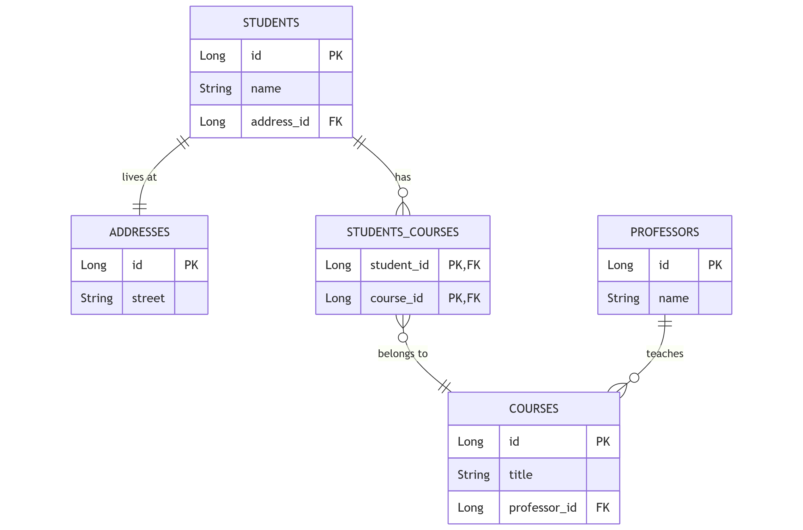

# ✏️ JPA Demo

Este es un proyecto para poder poner en práctica lo visto en la sesión 12 de nuestro bootcamp.
Se plantean las entidades base para realizar el challenge. Ustedes deben resolver lo siguiente:

## 💡 Todo

- [x] Agregar las anotaciones necesarias entre `Professor` y `Course` para conseguir la relación `1xn` entre estas dos
  entidades.
- [x] Agregar las anotaciones necesarias para cumplir con `nxn` entre `Student` y `Course`.
- [x] Implementar un método que permita encontrar todos los estudiantes cuyo `name` empiece por una letra dada.
- [x] Crear un método para encontrar todos los cursos por un profesor dado su `name` exacto.
- [x] Usando **JPQL** crear un método que permita encontrar todos los estudiantes que viven en una `street` dada.
- [x] Usando **JPQL** y **proyecciones** crear un método que devuelva una lista del nombre de los cursos con su total de
  alumnos.

## 🖼️ Diagrama ER

Made with ❤️ by David Reyes